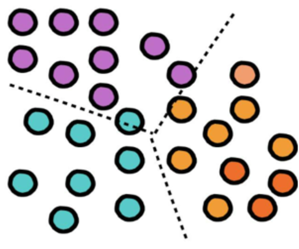
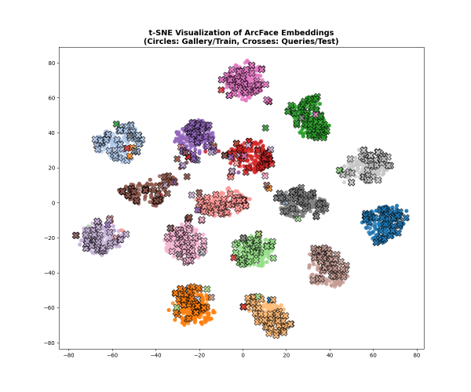
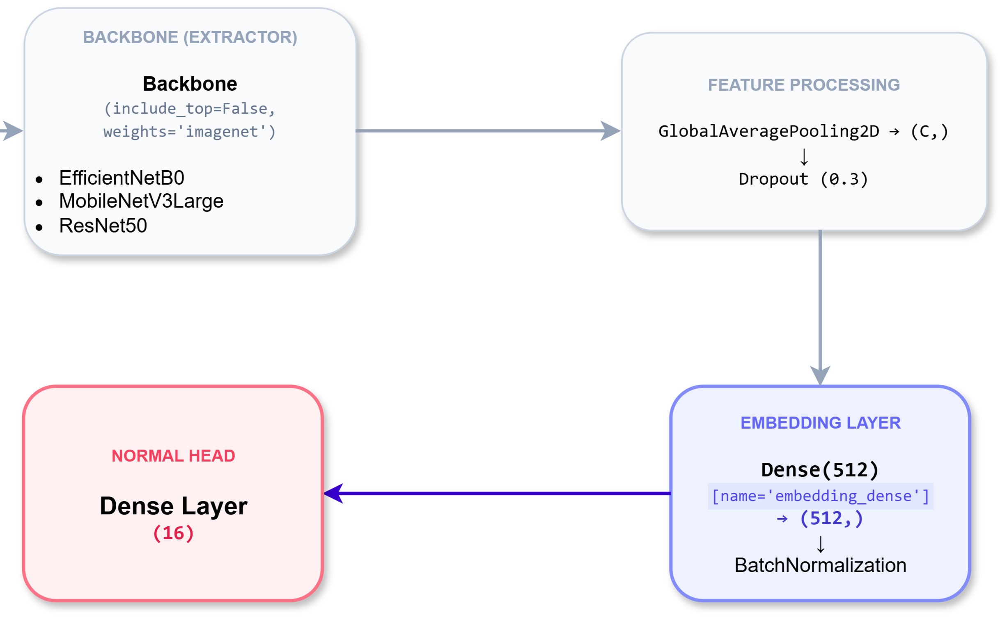
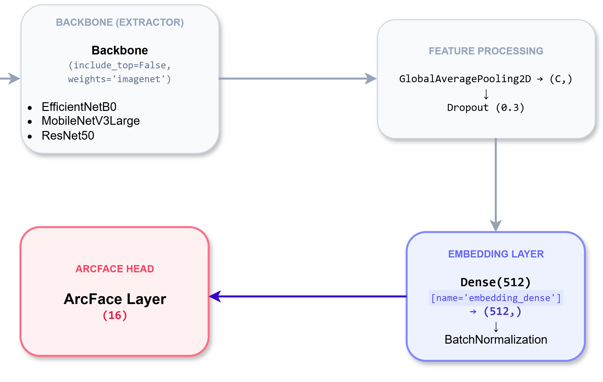

# 🌿 Deep Metric Learning & Fine-Grained Botanical Visual Search Pipeline

[](https://www.kaggle.com/khilnguynanh/deep-metric-learning-fine-tuning-pipeline)
[](https://tensorflow.org)
[](https://python.org)

> An empirical deep metric learning framework exploring **Additive Angular Margin Loss (ArcFace)** and **progressive layer unfreezing** for fine-grained botanical retrieval. This pipeline projects botanical imagery into a normalized 512-dimensional metric hypersphere optimized for downstream vector indexing engines such as PostgreSQL with `pgvector`.

### ⚡ Quick Highlights for Reviewers
* **Core Problem:** Fine-grained botanical visual retrieval under high intra-class leaf polymorphism and inter-class mimicry.
* **Key Innovation:** Custom ArcFace metric learning head + 3-tier progressive backbone fine-tuning (EfficientNet, MobileNetV3, ResNet50).
* **Impact & Result:** +10% to +20% relative uplift in Recall@1/mAP@5 over ImageNet baselines; optimized for sub-millisecond retrieval with PostgreSQL `pgvector`.
* **Tech Stack:** TensorFlow 2.x, Albumentations, PostgreSQL (`pgvector`), Scikit-learn, Docker, Kaggle P100.

---

## 1. Problem Formulation: Closed-Set Classification vs. Content-Based Retrieval (CBIR)

In computational vision, **Closed-Set Image Classification** and **Content-Based Image Retrieval (CBIR)** target distinct mathematical objectives:

* **Image Classification:** Seeks optimal decision hyperplanes that divide feature space between categorical boundaries. Because the objective only requires samples to fall on the correct side of a boundary, intra-class variance remains unconstrained. Consequently, two distinct leaf specimens belonging to the same botanical species can reside far apart in feature space while still achieving high classification accuracy.
* **Content-Based Retrieval (CBIR):** Replaces categorical decision boundaries with a continuous, structured **Metric Space**. The objective explicitly minimizes intra-class dispersion while maximizing inter-class margins on a unit hypersphere. Under this formulation, geometric proximity directly correlates with morphological and biological similarity.

| Dimension | Conventional Classification | Metric Learning for CBIR |
| :--- | :--- | :--- |
| **Optimization Target** | Maximizing posterior probability $P(y \mid x)$ | Contracting intra-class variance and expanding inter-class angular margins |
| **Feature Geometry** | Unconstrained linear partitioning | Highly clustered, normalized hyperspherical embeddings |
| **Operational Scope** | Rigid output layer; requires retraining for novel classes | Generalizable feature extractor; suitable for dynamic vector indexing |

<table>
  <tr>
    <th width="50%"><div align="center">Conventional Classification Boundaries</div></th>
    <th width="50%"><div align="center">ArcFace Metric Clustering (t-SNE)</div></th>
  </tr>
  <tr>
    <td width="50%" align="center" valign="top">
      
    </td>
    <td width="50%" align="center" valign="top">
      
    </td>
  </tr>
  <tr>
    <td align="center" valign="top">
      <em>Figure 1: Standard classification hyperplanes enforce decision zones without constraining distance among same-class samples.</em>
    </td>
    <td align="center" valign="top">
      <em>Figure 2: Empirical 2D t-SNE projection: ArcFace forces representations of the same taxon to collapse into compact, separated clusters.</em>
    </td>
  </tr>
</table>

## 2. Mathematical Foundation: Cosine Metric & Database Vector Indexing

The retrieval engine integrates with PostgreSQL using the `pgvector` extension:

```sql
-- Nearest neighbor retrieval via Cosine Distance operator (<=>)
SELECT v.variety_id, v.common_name,
       1 - (pi.cnn_feature_vector::vector <=> %s::vector) AS similarity
FROM plant_images pi
JOIN varieties v ON pi.variety_id = v.variety_id
WHERE pi.part_type = %s AND pi.is_standard = true
ORDER BY pi.cnn_feature_vector::vector <=> %s::vector ASC
LIMIT 5;

````

### Mathematical Derivation

The `<=>` operator computes **Cosine Distance** between stored feature vector $u$ and query vector $v$:

$$D\_{\text{cosine}}(u, v) = 1 - \frac{u \cdot v}{\Vert{}u\Vert{}\_2 \Vert{}v\Vert{}\_2}$$

The resulting **Cosine Similarity** evaluates to:

$$\text{Similarity}(u, v) = 1 - D\_{\text{cosine}}(u, v) = \frac{u \cdot v}{\Vert{}u\Vert{}\_2 \Vert{}v\Vert{}\_2}$$

During inference, all extracted 512-D vectors are normalized using $L_2$-norm (`tf.nn.l2_normalize(x, axis=1)`):

$$\Vert{}u\Vert{}\_2 = 1 \quad \text{and} \quad \Vert{}v\Vert{}\_2 = 1 \implies \text{Similarity}(u, v) = u \cdot v = \cos(\theta)$$

By constraining embeddings to unit length, dot products map directly to angular displacement $\cos(\theta)$. The training objective therefore corresponds to driving intra-class angular separation $\theta$ toward zero.

## 3. Core Architecture: Custom ArcFace Layer & Angular Logit Optimization

Rather than terminating the network with an unconstrained fully connected layer `Dense(16)`, the architecture replaces the head with a **Custom ArcFace Layer**:

<table>
  <tr>
    <th width="50%"><div align="center">Baseline Linear Classification Head</div></th>
    <th width="50%"><div align="center">Proposed Metric Learning Head (ArcFace)</div></th>
  </tr>
  <tr>
    <td width="50%" align="center" valign="top">
      
    </td>
    <td width="50%" align="center" valign="top">
      
    </td>
  </tr>
  <tr>
    <td align="center" valign="top">
      <em>Figure 3: Conventional pipeline mapping 512-D embeddings directly to 16 linear logits.</em>
    </td>
    <td align="center" valign="top">
      <em>Figure 4: Proposed pipeline injecting normalized weights, angular margins, and ground-truth targets.</em>
    </td>
  </tr>
</table>

### Implementation Mechanism: Leveraging Native Categorical Cross-Entropy

Rather than defining a standalone custom loss function, the angular transformation is integrated directly within the Keras layer graph. Because the layer outputs modified logits, standard cross-entropy loss remains fully compatible:

Python

```
train_model.compile(
    optimizer=opt,
    loss=tf.keras.losses.CategoricalCrossentropy(from_logits=True) # ArcFace outputs modified angular logits
)

```

### Mathematical Logit Transformation Pipeline
#### 1. Eliminating Magnitude Bias (Hypersphere Projection)

In a conventional dense layer, the logit for class $j$ is computed as:

$$
z_j = W_j^T x + b_j = \|W_j\|_2 \|x\|_2 \cos(\theta_j) + b_j
$$

The custom layer normalizes both embedding $x$ and weight matrix columns $W$ using $L_2$-norm while omitting bias offsets ($b = 0$):

$$
\|x\|_2 = 1, \quad \|W_j\|_2 = 1 \implies z_j = \cos(\theta_j)
$$

*Implication:* Feature representations are projected onto a unit hypersphere. The network cannot exploit vector magnitudes to minimize loss, forcing convergence through angular alignment.

#### 2. Additive Angular Margin Penalty ($m$)

For ground-truth class $y_i$, an angular margin $m = 0.50 \text{ rad} \approx 28.6^\circ$ is added directly to target angle $\theta$:

$$
z_{y_i} = \cos(\theta_{y_i} + m)
$$

Trigonometric expansion ensures numerical stability in floating-point operations:

$$
\cos(\theta + m) = \cos(\theta)\cos(m) - \sin(\theta)\sin(m) = \cos(\theta)\cos(m) - \sqrt{1 - \cos^2(\theta)}\sin(m)
$$

#### 3. Gradient Scaling via Feature Scale ($s$)

Because cosine values are bounded within $[-1, 1]$, Softmax gradients saturate rapidly. A scaling factor $s = 30.0$ amplifies logit magnitudes to sustain backpropagation gradients:

$$
z_j = \begin{cases}
s \cdot \cos(\theta_j + m) & \text{for } j = y_i \\
s \cdot \cos(\theta_j) & \text{for } j \neq y_i
\end{cases}
$$

## 4. Experimental Strategy & Training Engineering

### K-Fold Cross-Validation for Hyperparameter Exploration

Botanical datasets often face sample size constraints across individual species. Static train-test splits introduce evaluation bias.

- A 5-fold cross-validation sweep evaluates convergence stability across folds.

- The average optimal convergence epoch per fold ($\text{Best Epoch}$) is extracted to set training schedules for final production models.


### 3-Tier Progressive Backbone Unfreezing

To prevent catastrophic forgetting of pre-trained ImageNet representations, a staged unfreezing protocol is applied:

1. **Stage 1 (Classifier Warmup):** The convolutional backbone remains frozen. Only the `Dense(512)` bottleneck and ArcFace layer are trained ($LR = 10^{-3}$).

2. **Stage 2 (Top \~20% Unfrozen):** The deepest residual/convolutional blocks (`block7a` on EfficientNet, `conv5_block1` on ResNet) are unfrozen ($LR = 10^{-4}$).

3. **Stage 3 (Top \~40% Unfrozen):** Deeper intermediate representations are unfrozen with minimal learning rates ($LR = 10^{-5}$).

4. *Statistical Preservation:* All `BatchNormalization` layers remain frozen (`trainable=False`) across all unfreezing phases to prevent moving mean and variance estimates from drifting on small batch sizes.


### Online Stochastic Data Augmentation (Albumentations)

Data transformations execute within the `tf.data` pipeline during batch generation:

- **Geometric Invariance:** Random rotations with reflection padding (`BORDER_REFLECT_101`), perspective shifts, and multi-scale cropping (`RandomResizedCrop`).

- **Photometric Robustness:** Contrast Limited Adaptive Histogram Equalization (`CLAHE`), illumination shadows (`RandomShadow`), and sensor noise (`ISONoise`).

- **Occlusion Masking:** `CoarseDropout` simulates foliage overlap and insect damage, forcing the network to extract venation patterns rather than relying on global leaf contours.


## 5. Critical Analysis: Performance & Domain Limitations

### Relative Retrieval Performance

Across multi-protocol retrieval evaluations (specifically **Protocol 3: Extended Production Gallery**, where query samples are matched against an index comprising all training and test holdouts), the angular margin formulation yields an estimated **10% to 20% relative improvement** in **Recall\@1, Recall\@5, and mAP\@5** compared to embeddings extracted from unconstrained linear Softmax classifiers.

### Theoretical Limitations in Botanical FGVC

Applying ArcFace to botanical taxonomy introduces domain-specific trade-offs:

1. **Unimodal Distribution Assumption:** ArcFace assigns a **single centroid vector ($W_i$)** on the hypersphere to each category. While suitable for human facial recognition, botanical taxa exhibit pronounced intra-class polymorphism: immature leaves, mature foliage, and diseased specimens display distinct visual modes.

2. **Gradient Stress from Enforced Compactness:** Imposing a rigid angular margin ($m=0.5$) across morphologically diverse specimens can penalize natural biological variations, inducing gradient conflict during optimization.

3. *Future Research Direction:* Mitigating intra-class polymorphism by transitioning to **Sub-center ArcFace** (allocating $K$ sub-centroids per species) or deploying dynamic, variance-aware margin schedules.


## 6. Execution & Kaggle Reproduction Guide (GPU P100)

To avoid VRAM out-of-memory errors and maximize compute efficiency on Kaggle, the pipeline is divided into dedicated runtime sessions:

### Step 1: Hyperparameter Exploration (K-Fold Sweep)
Execute `2. K-Fold Cross-Validation & Hyperparameter Exploration` across folds to identify convergence trends and verify loss progression.

### Step 2: Production Model Training (Parallelized Sessions)
Execute models across independent notebook runs using dedicated GPU instances:
- **Session 1 (EfficientNetB0):** Set `TARGET_MODEL = 'EfficientNetB0'`, unfreeze from `block7a_expand_conv` (Stage 1: 37 epochs, Stage 2: 52 epochs).
- **Session 2 (MobileNetV3Large):** Set `TARGET_MODEL = 'MobileNetV3Large'`, unfreeze from `expanded_conv_12_expand` (Stage 1: 33 epochs, Stage 2: 38 epochs).
- **Session 3 (ResNet50):** Set `TARGET_MODEL = 'ResNet50'`, unfreeze from `conv5_block1_1_conv` (Stage 1: 36 epochs, Stage 2: 26 epochs).

### Step 3: High-Dimensional Manifold Inspection (t-SNE)
Execute `5. High-Dimensional Embedding Visualization (t-SNE)` with `perplexity=30` to project the 512-D embeddings onto a 2D plane, generating qualitative cluster validation plots.